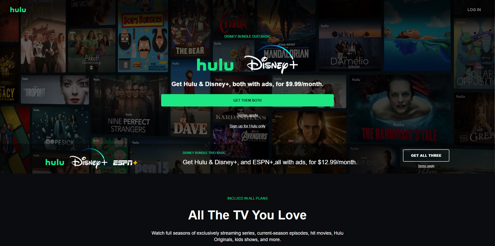
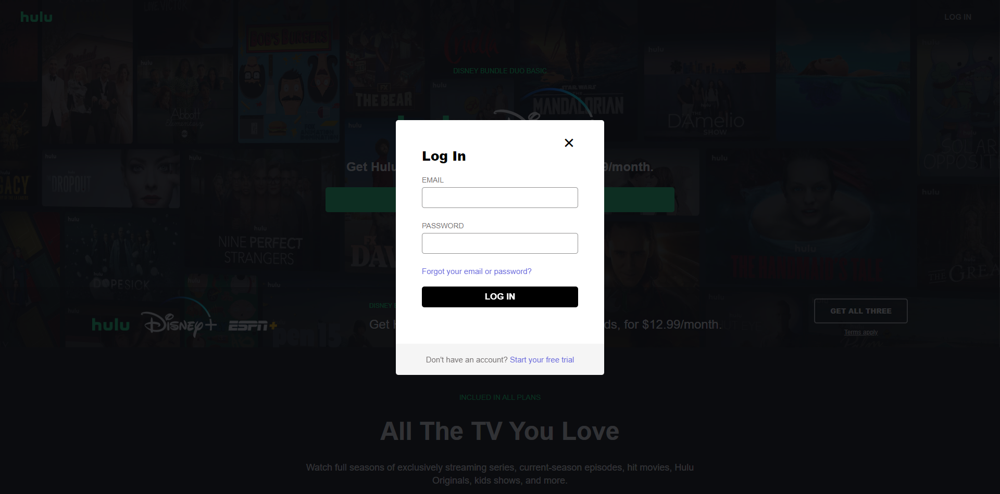
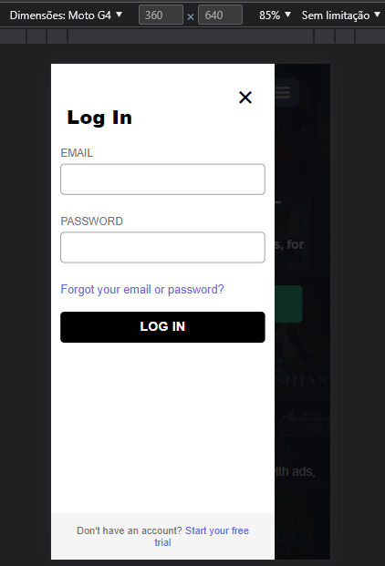

# Projeto clone do Site Hulu

* Projeto feito em HTML, CSS e JAVASCRIPT.

- Clone do site hulu na versão desktop e mobile.

- Pop-up para chamar o formulário

  

  

## Responsivo:sunglasses:

- Totalmente responsivo para qualquer formato de mídia.

   

  

  